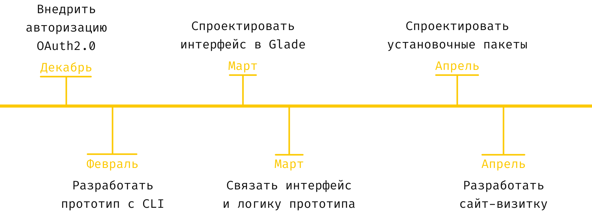

    

<h3 align="center">
    Десктоп приложение для стримингового сервиса Яндекс Музыка для операционной системы Linux
</h3>

<h2>
Цель проекта
</h2>

Разработать нативное десктоп приложение для стримингово сервиса Я.Музыка для операционной системы Linux с использованием кроссплатформенной библиотеки графического интерфейса GTK и неофициального API от MarshalX.

<h2>
План работы
</h2>

    

<h2>
Презентация
</h2>

<h2>
Благодарности
</h2>
В проекте использованы работы:

- https://github.com/oaubert/python-vlc
- https://github.com/MarshalX/yandex-music-api

